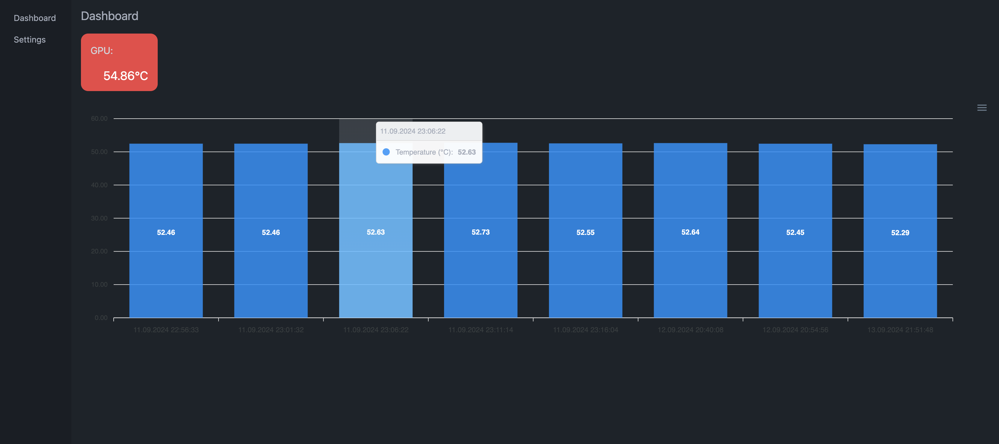

# RPI Healthcheck

A simple app to monitor Raspberry Pi's temperatures.

## Project overview:

### Server:

Written in GO, using mostly standard libraries, with help of `GORM` and `gorilla/websocket`.
Database used is SQLite.

### Client:

`Vue 3`, `Pinia` for state management, `TypeScript`, `ApexCharts`, `DaisyUI` and `TailwindCSS`.

### Mock Commands:

For testing purpouses, I had to polyfill missing commands that would be available on Raspberry Pi.
`source setup-mock.sh` in `mock-commands` folder if you're developing outside of Raspberry Pi.

## App:

### Main Dashboard

In the red square there is a live readout sent from the server via websocket. The chart represents average temperatures from the last week 